# EXPERIMENT 1:
Data Cleaning Process

## AIM:
To read the given data and perform data cleaning and save the cleaned data to a file.

## EXPLANATION:
Data cleaning is the process of preparing data for analysis by removing or modifying data that is incorrect ,incompleted , irrelevant , duplicated or improperly formatted. Data cleaning is not simply about erasing data ,but rather finding a way to maximize datasets accuracy without necessarily deleting the information.

## ALGORITHM:
STEP 1: Read the given Data

STEP 2: Get the information about the data

STEP 3: Remove the null values from the data

STEP 4: Save the Clean data to the file

STEP 5: Remove outliers using IQR

STEP 6: Use z-score of to remove outliers

## PROGRAMS:
```python
import pandas as pd

#READ CSV FILE HERE
df=pd.read_csv("SAMPLEIDS (1).csv")
df=pd.DataFrame(df)
df
```
## Output:
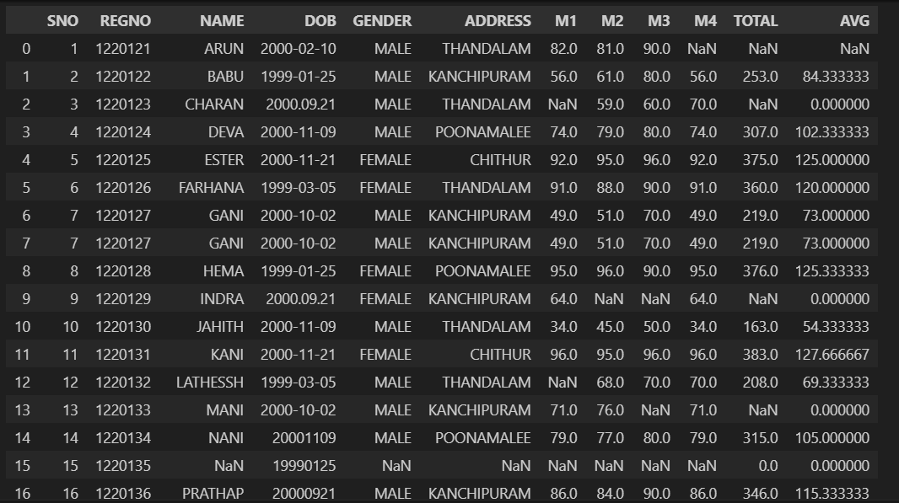

## DISPLAY THE INFORMATION ABOUT CSV AND RUN THE BASIC DATA ANALYSIS FUNCTIONS:
```python

df.info()
```

## Output:
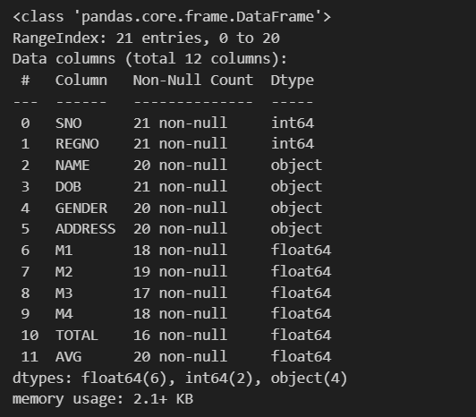

## CHECK OUT NULL VALUES IN DATA SET USING FUNCTION:
```python
df.isnull()
```
## Output:
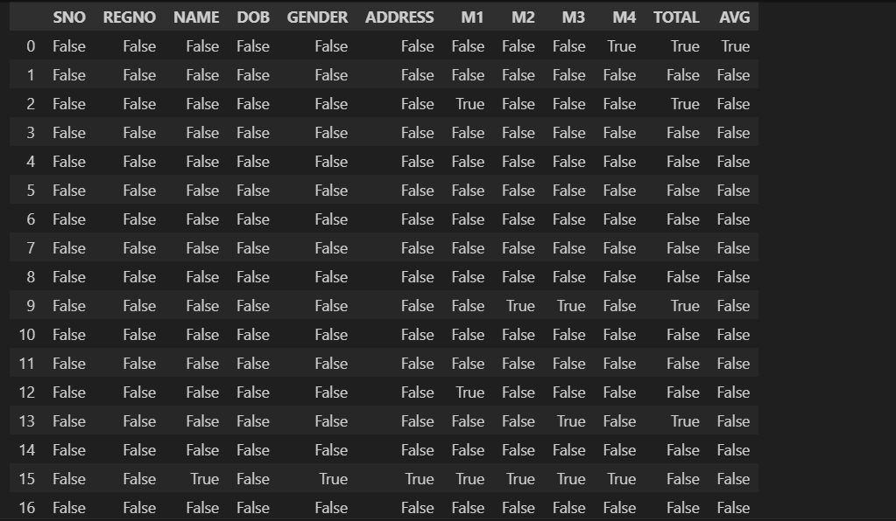

## DISPLAY THE SUM ON NULL VALUES IN EACH ROWS:
```python
df.isnull().sum()
```
## Output:
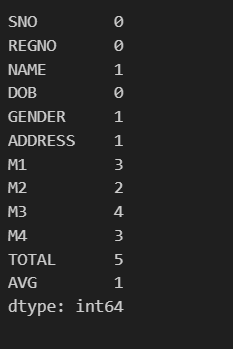

## DROP NULL VALUES(ANY):
```python
df.dropna(how='any')
```

## Output:
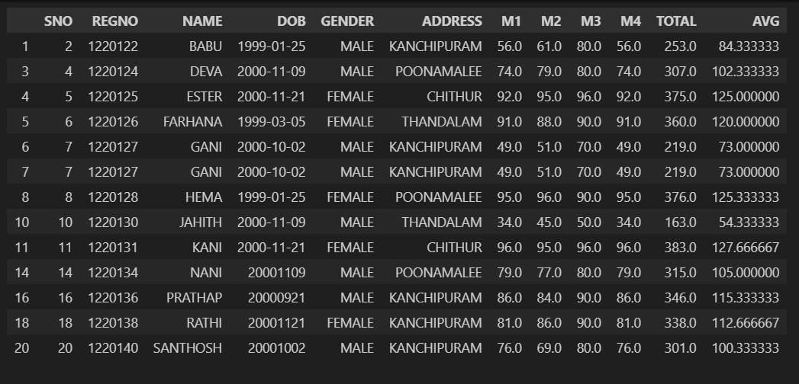

## DROP NULL VALUES WITH THE SPECIFIC ROWS(ANY):
```python
df_any_row = df.dropna(axis=0, how='any')
df_any_row
```
## Output:
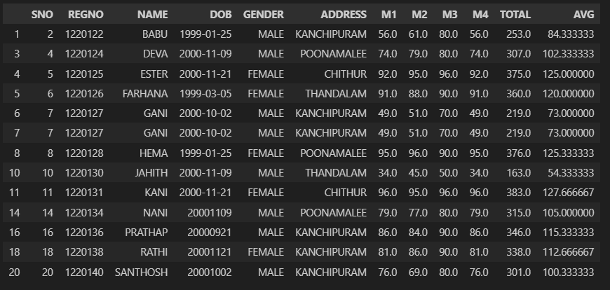

## DROP NULL VALUES WITH THE SPECIFIC COLUMN(ANY):
```python
df_any_column = df.dropna(axis=1, how='any')
df_any_column
```

## Output:
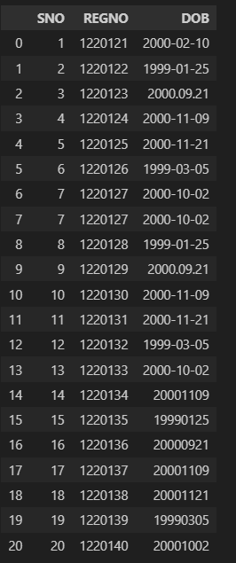


## DROP NULL VALUES(ALL):
```python
df.dropna(how='all')
```

## Output:
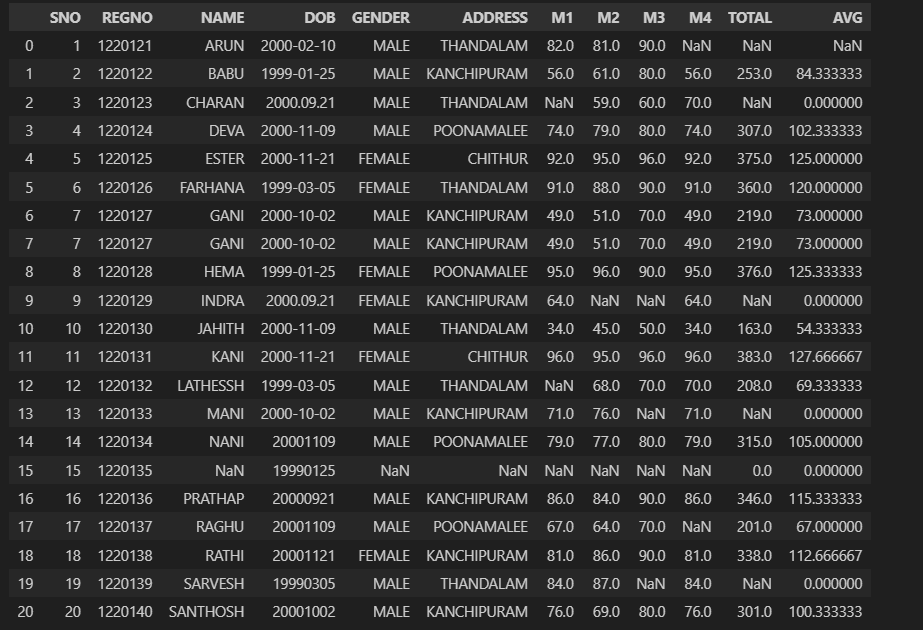

## DROP NULL VALUES WITH SPECIFIC ROWS(ALL):
```python
df_any_ROW = df.dropna(axis=0, how='all')
df_any_ROW
```
## Output:
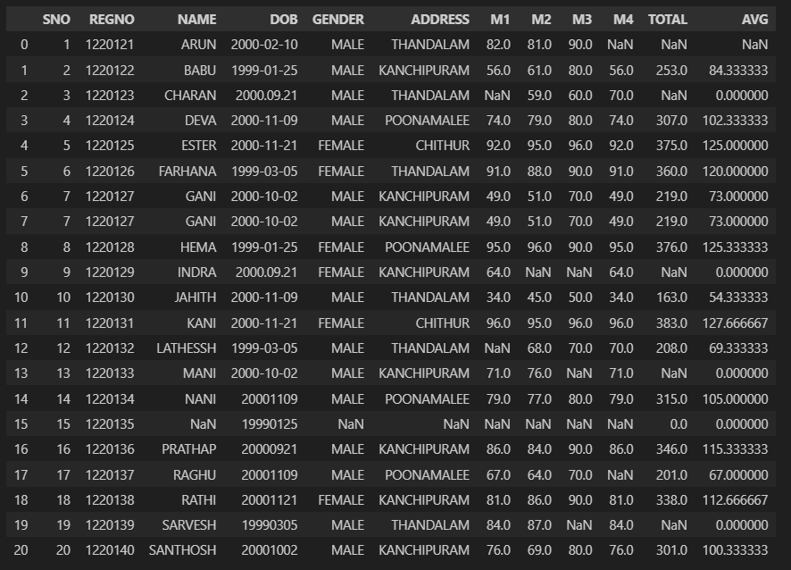

## DROP NULL VALUES WITH SPECIFIC COLUMN(ALL):
```python
df_any_COLUMN = df.dropna(axis=1, how='all')
df_any_COLUMN
```
## Output:
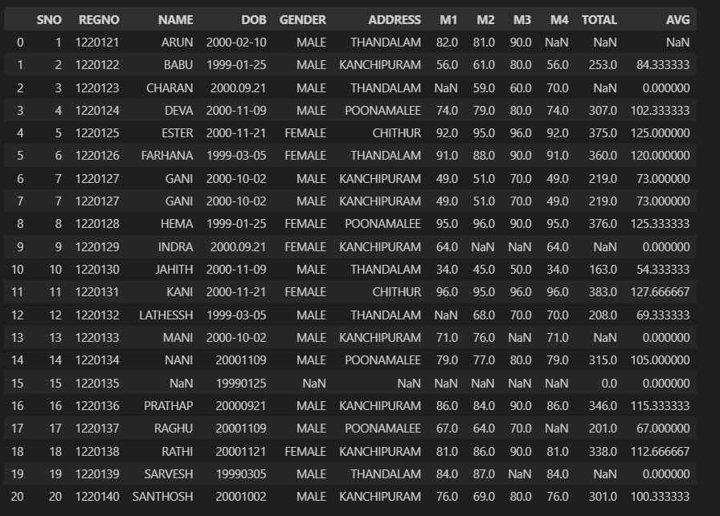

## FILL NULL VALUES WITH CONSTANT VALUE "O":
```python
df_filled = df.fillna("O")
df_filled
```
## Output:
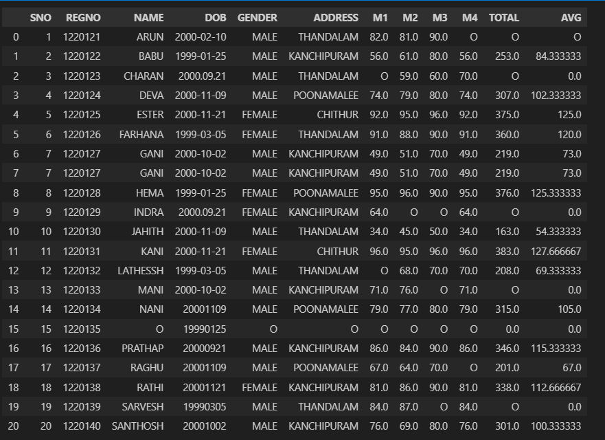

#FILL NULL VALUES WITH ffill or bfill METHOD

## FORWARD FILL(ffill):
```python
df_ffill = df.fillna(method='ffill')
df_ffill
```
## Output:
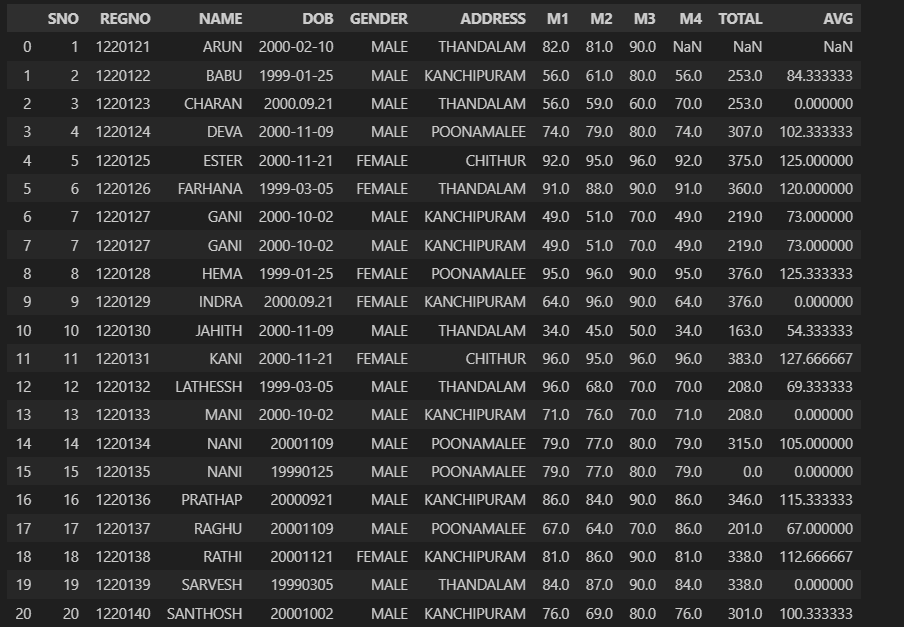

## Backward Fill (bfill):
```python
df_bfill = df.fillna(method='bfill')
df_bfill
```

## Output:
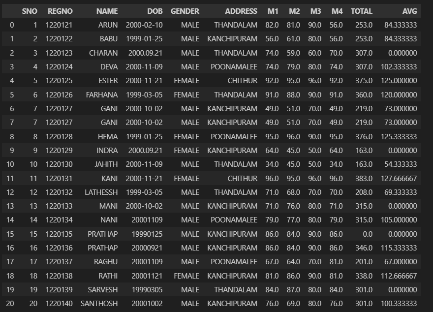

## CALCULATE MEAN VALUE OF All THE COLUMN AND FILL IT WITH NULL VALUES:
```python
mn=df.mean()
print(mn)

df.fillna(mn,inplace=True)
print(df)
```
## Output:
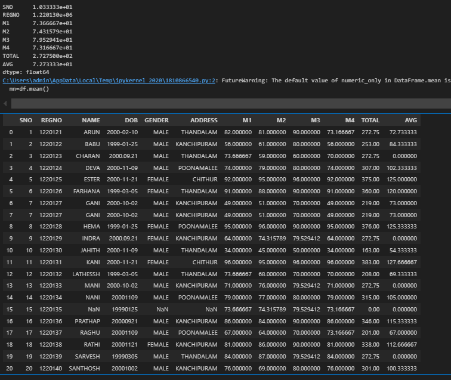

## DROP DUPLICATES 
```python
df.drop_duplicates(inplace=True)
df
```
## Output:
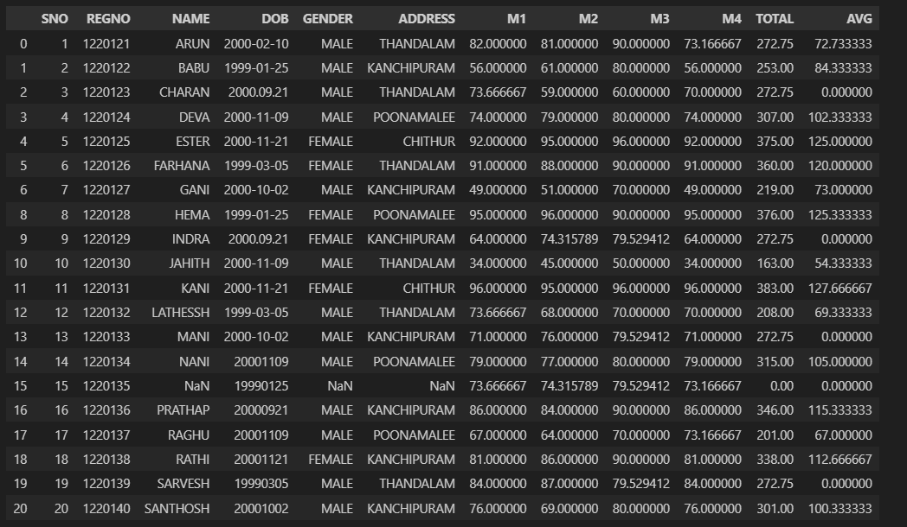

## DROP THE NULL VALUES AND PERMANTLY REMOVED THE SPECIFIC ROW:
```python
df.dropna(axis=0,how='any',inplace=True)
df
```

## Output:
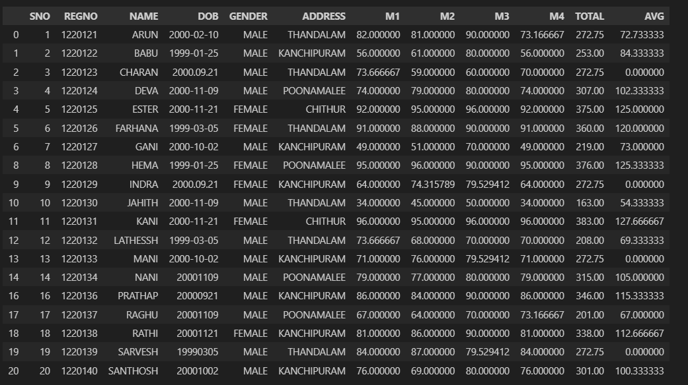

## IT SHOWS THE DUPLICATED VALUES IN THE OVERALL DATAFRAME:
```python
df.duplicated()
```

## Output:
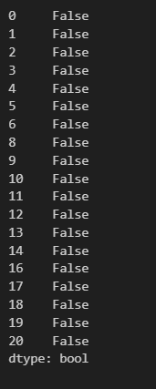

## PRINT THE COLUMN OF DOB:
```python
df['DOB']
```

## Output:
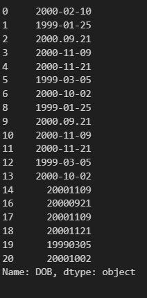

## TO PRINT THE DATE OF YOUR GIVEN FORMAT:
```python
x=df['DOB'] = pd.to_datetime(df['DOB'], format=('%Y-%m-%d'))
x
```

## Output:
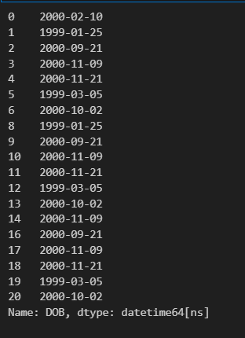

## CREATE A HEATMAP TO VISUALIZE MISSING VALUES:
```python
import pandas as pd
import seaborn as sns
sns.heatmap(df.isnull(),yticklabels=False,annot=True)
```
## Output:
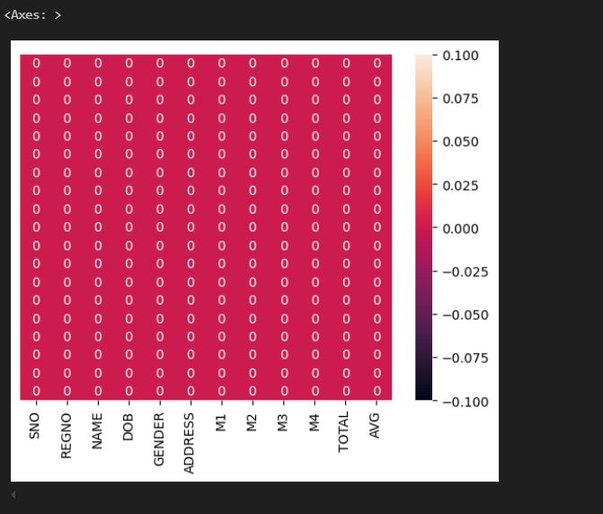

## IQR(Interquartile Range):
```python
import pandas as pd
import seaborn as sns
import numpy as np

age=[1,3,28,27,25,92,30,39,40,50,26,24,29,94]
af=pd.DataFrame(age)
af
```
## Output:
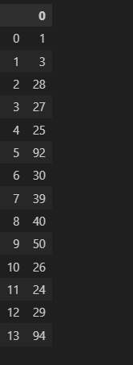

## USE BOXPLOT FUNCTION HERE TO DETECT OUTLIER:
```python
sns.boxplot(data=af)
```

## Output:
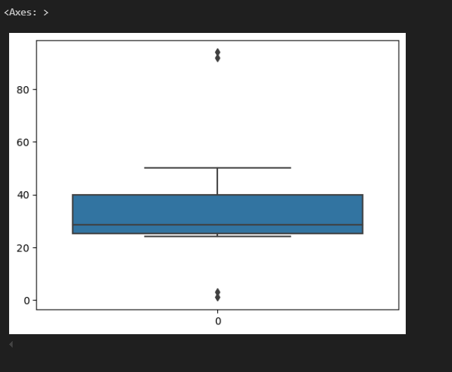

## USE SCATTERPLOT FUNCTION HERE TO DETECT OUTLIER:
```python
sns.scatterplot(data=af)
```

## Output:
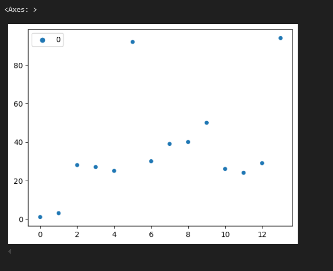

## IQR METHOD TO FIND THE OUTLIERS VALUES:
```python
q1=np.quantile(age,0.25)
q2=np.quantile(age,0.50)
q3=np.quantile(age,0.75)
iqr=q3-q1
print("IQR:",iqr)
lower_bound=q1-1.5*iqr
upper_bound=q3+1.5*iqr
print("LOWER BOUND:",lower_bound)
print("UPPER BOUND:",upper_bound)

outliers=[x for x in age if x < lower_bound or x > upper_bound]

print("Q1:",q1)
print("Q2:",q2)
print("Q3:",q3)
print("IQR:",iqr)
print("Lower Bound:",lower_bound)
print("Upper Bound:",upper_bound)
print("Outliers:",outliers)
```

## Output:
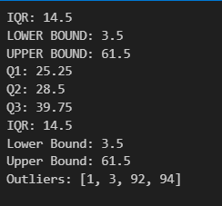

## TO PRINT THE NEAREST VALUES AND OTHERS GIVES NULL VALUES:
```python
af=af[((af>=lower_bound)&(af<=upper_bound))]
af
```
## Output:
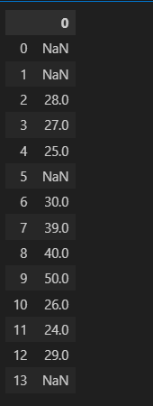

## REMOVE OUTLIERS:
```python
af.dropna()
```
## Output:
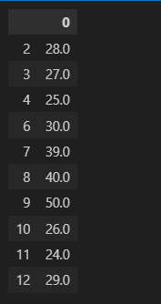

## USE BOXPLOT FUNCTION HERE TO CHECK OUTLIER IS REMOVED:
```python
sns.boxplot(data=af)
```
## Output:
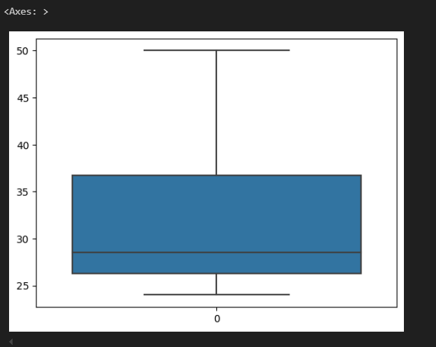

## USE SCATTERPLOT FUNCTION HERE TO CHECK OUTLIER IS REMOVED:
```python
sns.scatterplot(data=af)
```
## Output:
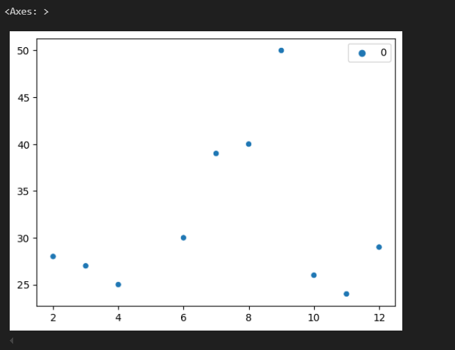

## STATS METHOD IS USED TO IMPLEMENT Z SCORE METHOD:
```python
from scipy import stats 
import numpy as np
import matplotlib.pyplot as plt

data=[1,12,15,18,21,24,27,30,33,36,39,42,45,48,51,54,57,60,63,66,69,72,75,78,81,84,87,90,93,96,99,158]
mean=np.mean(data)
std=np.std(data)
print("Mean of the dataset is",mean)
print("Std. deviation is",std)

threshold=3
outlier=[]
z_scores=[]
for i in data:
    z = (i - mean) / std
    z_scores.append(z)
    if abs(z) > threshold:
        outlier.append(i)
print("Outlier in dataset is",outlier)
```
## Output:
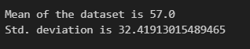
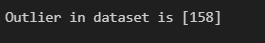

## ANOTHER METHOD TO FIND THE Z-SCORE:
```python
z=np.abs(stats.zscore(data1))
data1[data1>3]
```

## Output:
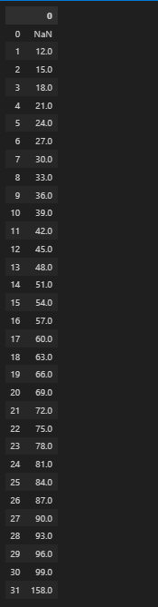

## USE BOXPLOT FUNCTION HERE TO DETECT OUTLIER:
```python
sns.boxplot(data=data)
```
## Output:
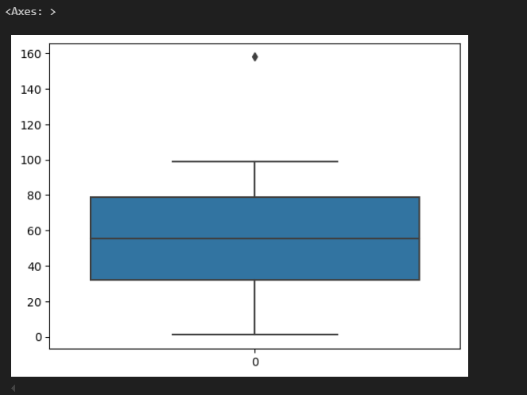

## USE SCATTERPLOT FUNCTION HERE TO DETECT OUTLIER
```python
sns.scatterplot(data=data)
```

## Output:
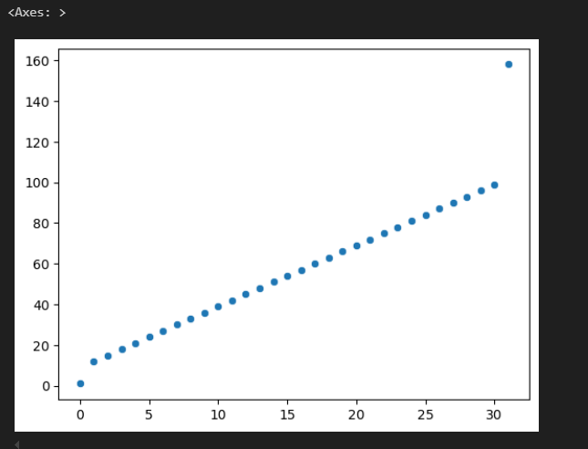

## REMOVE THE OUTLIERS:
```python
cleaned_data = [i for i in data if i not in outlier]
print("Data after removing outliers:", cleaned_data)
```

## Output:
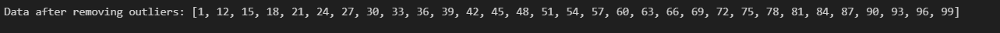

## VISUALIZE ORIGINAL DATA WITH A BOXPLOT:
```python
plt.figure(figsize=(10, 6))
sns.boxplot(data=data)
plt.title('Boxplot of Original Data')
plt.show()
```

## Output:
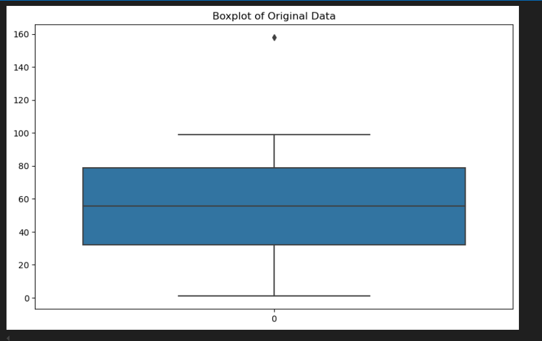

## VISUALIZE CLEANED DATA WITH A BOXPLOT:
```python
plt.figure(figsize=(10, 6))
sns.boxplot(data=cleaned_data)
plt.title('Boxplot of Cleaned Data')
plt.show()
```
## Output:
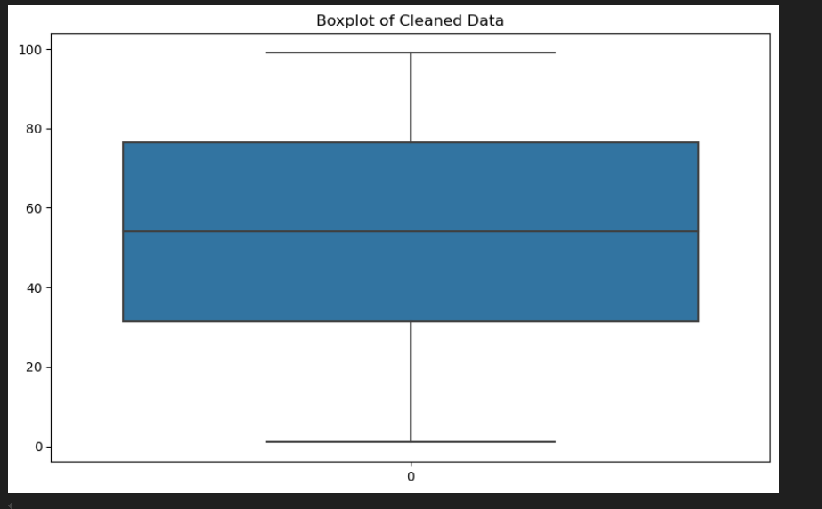

## RESULT:
Thus we have cleaned the data and removed the outliers by detection using IQR and Z-score method.

